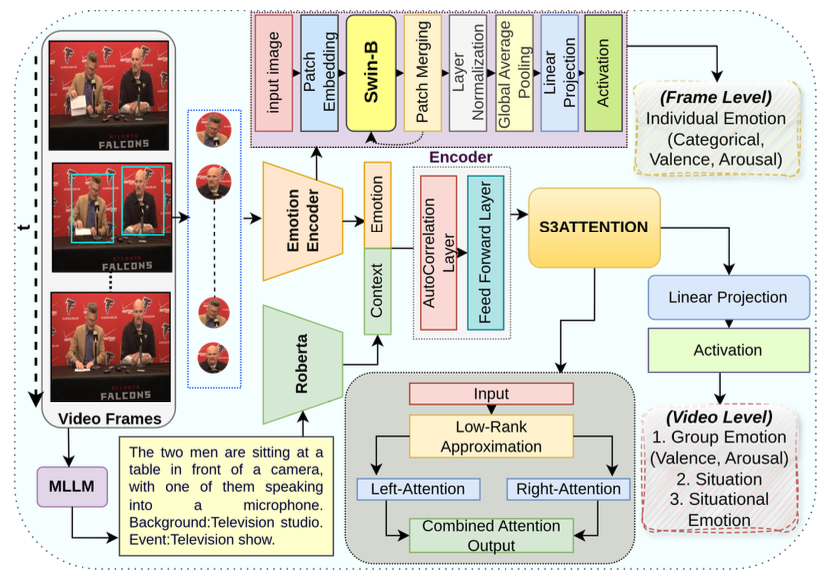

# GEMS: Group Emotion Profiling through Multimodal Situational Understanding

This is the official repository for the paper **GEMS: Group Emotion Profiling through Multimodal Situational Understanding**

## Abstract

Understanding individual, group and event level emotions along with contextual information is crucial for analyzing a multi-person social situation. To achieve this, we frame emotion comprehension as the task of predicting fine-grained individual emotion to coarse grained group and event level emotion. We introduce GEMS that leverages a multimodal swin-transformer and S3Attention based architecture, which processes an input scene, group members, and context information to generate joint predictions. Existing multi-person emotion related benchmarks mainly focus on atomic interactions primarily based on emotion perception over time and group level. To this end, we extend and propose VGAF-GEMS to provide more fine grained and holistic analysis on top of existing group level annotation of VGAF dataset. GEMS aims to predict basic discrete and continuous emotions (including valence and arousal) as well as individual, group and event level perceived emotions. Our benchmarking effort links individual, group and situational emotional responses holistically. The quantitative and qualitative comparisons with adapted state-of-the-art models demonstrate the effectiveness of GEMS framework on VGAF-GEMS benchmarking.

## Framework Overview

*Framework overview: GEMS connects individual emotions, scene interactions, and event understanding for multi-label prediction in a multi-task learning setup using multimodal swin-transformer and S3Attention architecture.*

## Implementation Details

Coming Soon
